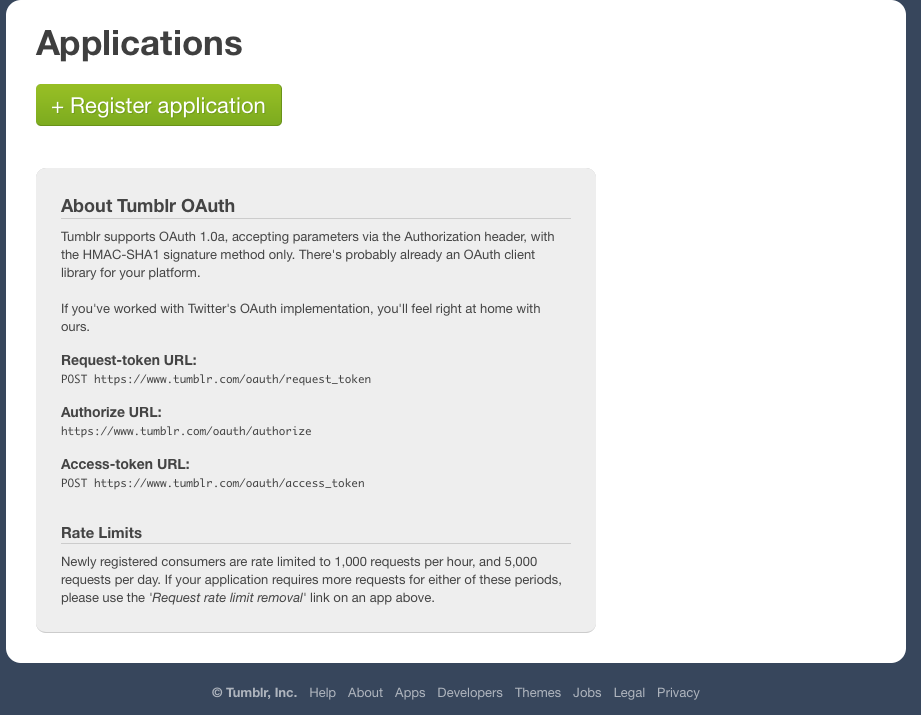
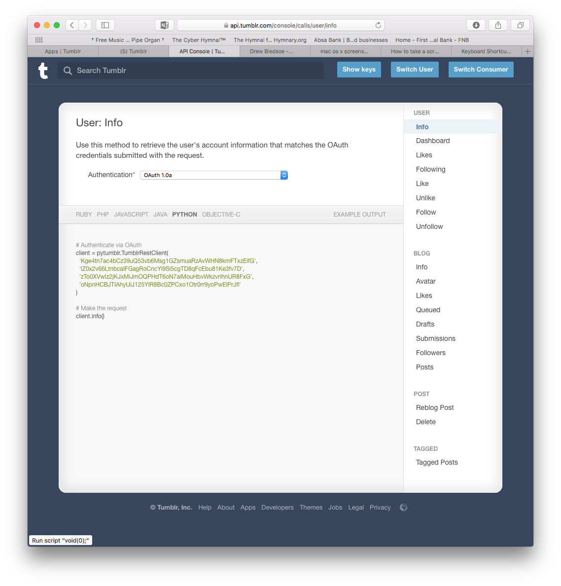

# Delete All Tumblr Blogs
Python script to delete all the blogs I follow from tumblr.
* Over 800 I'm following
* No easy way to delete those blogs

## Setup Instructions
1. Create an app in tumblr.
  * https://www.tumblr.com/oauth/apps
  * 
1. Get keys and tokens.
  * https://api.tumblr.com/console/calls/user/info
  * 
1. Create settings file with keys
  * Create *.settings.ini* - Example: *ex.settings.ini*

## Edit script and run it.
* Run `python tumblr.py` - basic script will list all of the blogs you are following
